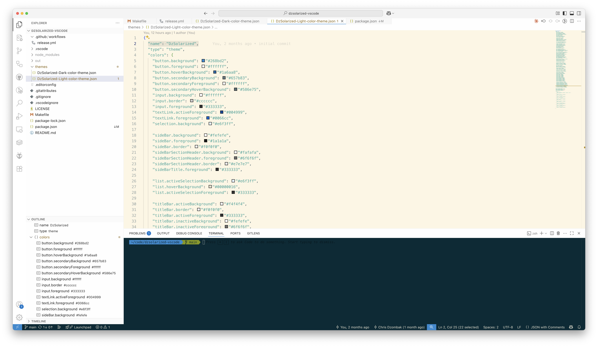
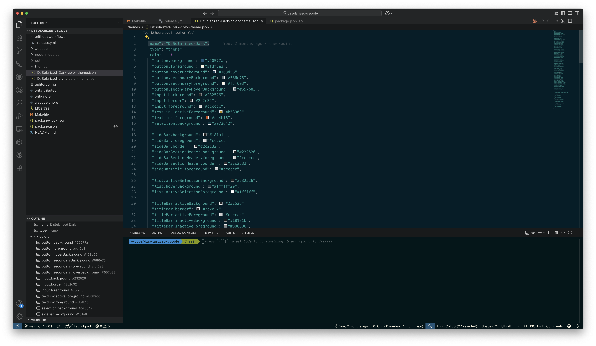

# dzsolarized-vscode

[Solarized](https://ethanschoonover.com/solarized/)-derived theme for [VS Code](https://code.visualstudio.com) and compatible editors (e.g. [Cursor](https://cursor.com)), reflecting [@cdzombak](https://github.com/cdzombak)'s personal preferences.

## Screenshots

## Installation

### Marketplace

Install from the [Visual Studio Code Marketplace](https://marketplace.visualstudio.com/items?itemName=ChrisDzombak.dzsolarized).

### Manual Installation

1. Download the `.vsix` file from [the latest release](https://github.com/cdzombak/dzsolarized-vscode/releases/latest).
2. In VS Code, open the Command Palette (`Cmd+Shift+P` or `Ctrl+Shift+P`).
3. Select **Extensions: Install from VSIX...**.
4. Browse to the downloaded `.vsix` file and select it.
5. Reload VS Code if prompted.
